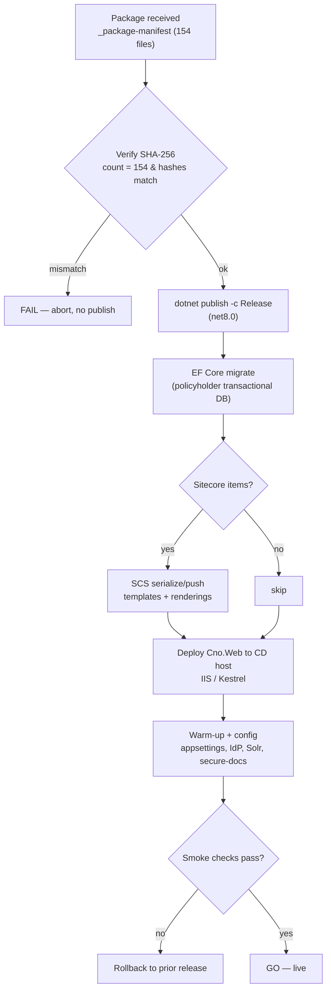

# Deploy Summary & Runbook — CNO Policyholder-Account Portal (Sitecore XP / .NET 8)

> **System:** CNO policyholder self-service portal (`cno-mini-svc-hook`)
> **Source platform:** Liferay 6.2 EE
> **Target platform:** Sitecore XP / XM 10.x · .NET 8.0 · MVC/SXA C#
> **Artifact:** `Cno.Web` + `Cno.Domain` — 154 files · build PASSED · SHA-256 manifested
> **Date:** 2026-07-13 · **Prepared by:** aiDAP Technical Discovery · **Version:** 1.0

---

## Table of Contents

1. [Deploy Outcome](#1-deploy-outcome)
2. [Deploy Pipeline](#2-deploy-pipeline)
3. [Deploy Steps (Runbook)](#3-deploy-steps-runbook)
4. [Verification & Smoke Checks](#4-verification--smoke-checks)
5. [Rollback](#5-rollback)
6. [Post-Deploy — Confidence-Driven UAT Scope](#6-post-deploy--confidence-driven-uat-scope)

---

## 1. Deploy Outcome

The gate-passed package (154 files, 0 build errors, SHA-256 manifested — PACKAGE-SUMMARY) is deployed as a **.NET application publish** onto a Sitecore XP 10.x delivery host. This is an application deployment, not a content package: policyholder data is transactional (EF Core → SQL Server), and Sitecore item serialization (SCS) is a minimal, optional step for any authored templates/renderings. The deploy is **repeatable and reversible** — publish is versioned and the previous release is retained for rollback.

| Attribute | Value |
|---|---|
| Deploy mode | .NET publish (framework-dependent, .NET 8) → IIS / Kestrel |
| Package integrity | Verified — 154 files, per-file SHA-256 matched |
| Item serialization | Optional SCS push (minimal templates/renderings) |
| Data | EF Core migrations → SQL Server (transactional) |
| Reversibility | Versioned release + retained prior build |
| Residual review carried in | BUILD-REPORT §8 (Services 72% / Pipelines 70% / SSO 66%) |

## 2. Deploy Pipeline

## 3. Deploy Steps (Runbook)

| # | Step | Command / action | Gate |
|---|---|---|---|
| 1 | **Verify package** | Recompute `files.sha256`; assert count = 154 and all hashes match `_package-manifest` | Abort on any mismatch |
| 2 | **Publish build** | `dotnet publish Cno.Web -c Release -f net8.0 -o ./publish` | Publish succeeds, 0 errors |
| 3 | **DB migrate** | `dotnet ef database update` against policyholder transactional DB | Migration idempotent + reversible |
| 4 | **Item serialization (optional)** | `dotnet sitecore ser push` (SCS) for any templates/renderings | Only if content items present |
| 5 | **Deploy app** | Copy `./publish` to Sitecore CD host; recycle IIS app pool / restart Kestrel | ASP.NET Core Module loads |
| 6 | **Configure** | Apply `appsettings.{env}.json` — connection strings, IdP (OIDC/SAML), Solr, secure-doc endpoints | Config validation on startup |
| 7 | **Warm-up** | Hit health endpoint; trigger Sitecore index rebuild if needed (Solr) | Health 200; index green |
| 8 | **Smoke** | Run §4 checks | All pass → GO; else §5 rollback |

## 4. Verification & Smoke Checks

Smoke checks are prioritized by the confidence floor from BUILD-REPORT — the authored layers (services, pipelines, SSO) get the most scrutiny.

| Check | Layer / confidence | Pass criterion |
|---|---|---|
| App health endpoint responds | Infra 99% | HTTP 200 |
| Login via external IdP | SsoFilter pipeline **66%** | SAML/OIDC round-trip succeeds, session established |
| Entitlement matrix enforced | EntitlementFilter **70%** | Each of 6 roles sees only permitted actions |
| Account summary renders | Policy service 76% / views 78% | Policy data displays correctly |
| Claim wizard completes | ClaimAdjudication **70%** / view 72% | Multi-step intake persists; adjudication decision returned |
| Payment allocation | Payment service **72%** | FIFO allocation + ledger post correct on a test payment |
| Secure document retrieval | Document service 76% | Signed-URL doc served; unauthorized denied |
| Solr search returns results | Persistence 95% | Secured search results returned |
| Transactional data reads | Repositories 95% | Policy/claim/invoice queries return expected rows |

## 5. Rollback

Rollback is a single-release reversion — the prior published build is retained and item/DB changes are reversible.

| Aspect | Rollback action |
|---|---|
| Application | Re-deploy prior `./publish` release; recycle app pool |
| Database | `dotnet ef database update <PreviousMigration>` (down-migration) |
| Sitecore items (if pushed) | SCS `push` of prior serialized set, or Sitecore package rollback |
| Config | Restore prior `appsettings.{env}.json` |
| Trigger | Any P1 smoke check fails (IdP login, entitlement, claim adjudication) |
| RTO target | Single release cycle — no rebuild required (prior artifact retained) |

## 6. Post-Deploy — Confidence-Driven UAT Scope

A green deploy plus passing smoke checks means the app is **running**, not **verified for correctness**. The honest confidence profile (overall ≈88.6%, but Services 72% / Pipelines 70% / SSO 66%) sets the mandatory UAT scope before production sign-off:

1. **P1 — Business logic UAT** on Underwriting rating, ClaimAdjudication (contestability window + coinsurance math), and Payment FIFO allocation, validated against Liferay parallel-run or documented expected outcomes.
2. **P1 — Identity** — full IdP federation test matrix (SsoFilter 66% is the single lowest-confidence artifact).
3. **P2 — Entitlement** — all 6 roles (Admin/CSR/Agent/Reviewer/AuthRep/Policyholder) against the authorization pipeline.
4. **P2 — Wizard flows** — claim, death-claim, annuity-distribution multi-step state.
5. **P3 — Deterministic spot-checks** — money value types, custom-SQL finder queries (untested at build).

> Sign-off recommendation: gate production cutover on P1 + P2 UAT completion, not on the green deploy alone. The deploy is real and reversible; the business-logic fidelity is honestly ~70–72% until human-verified.
